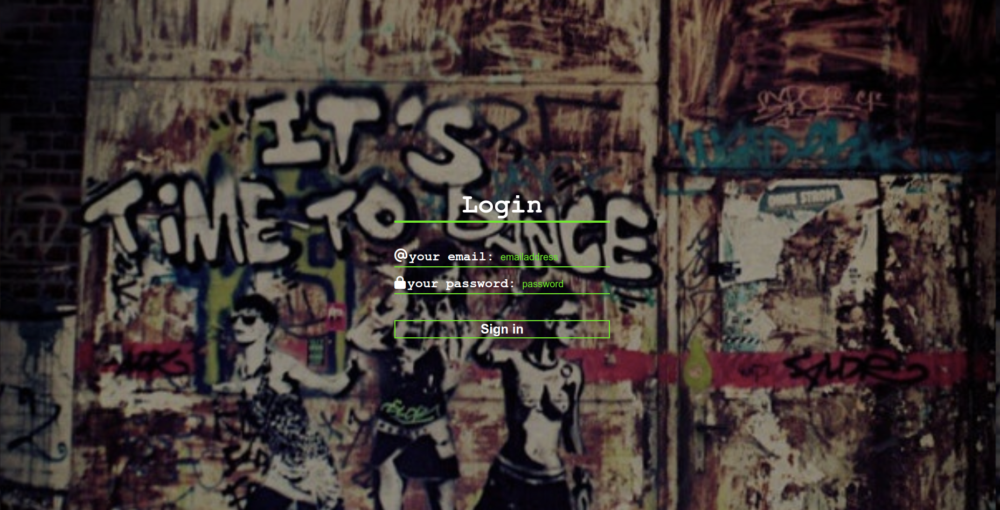
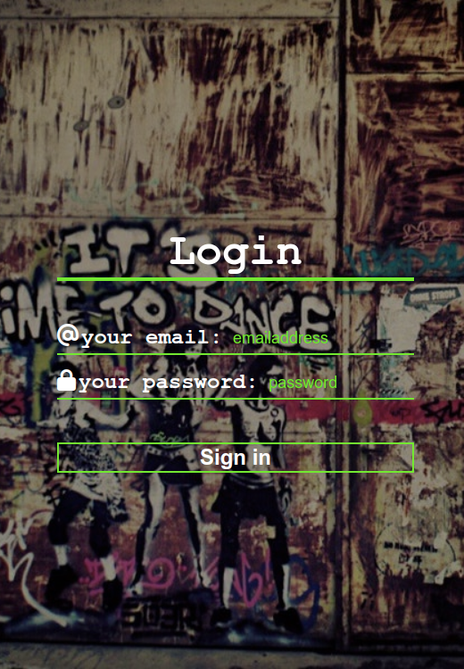

# "Time to Dance" - (transparent) Login

## Exercise Course-Module 1 - UserInterfaceBasics (UIB) - HTML/CSS

created at 12.09.22;

solved exercise on forms: transparent form with "time-to-dance"-graffiti-background-image,

#### My desktop version:

#### My mobile version:

